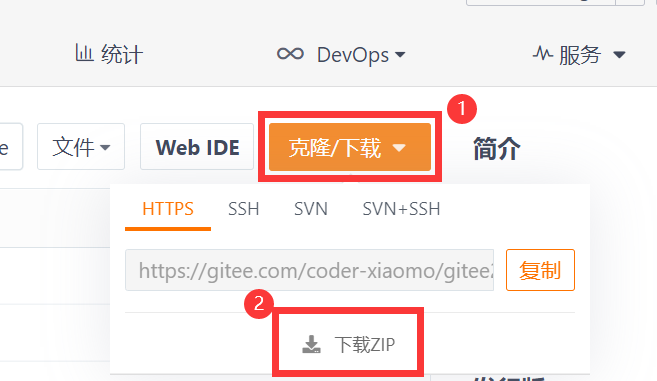
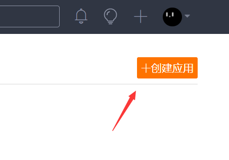
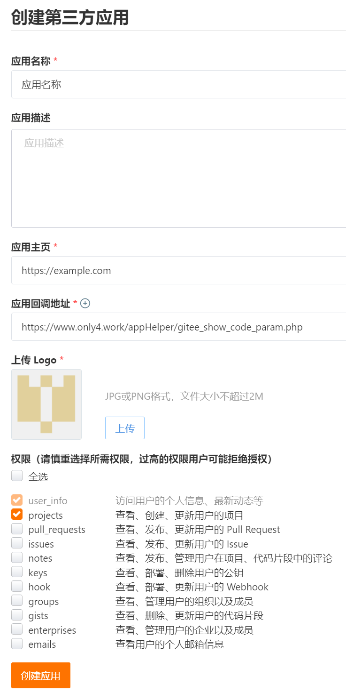
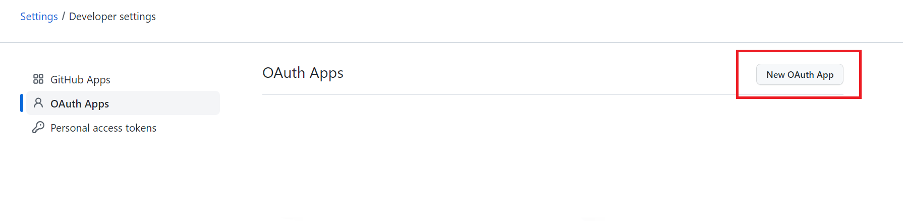
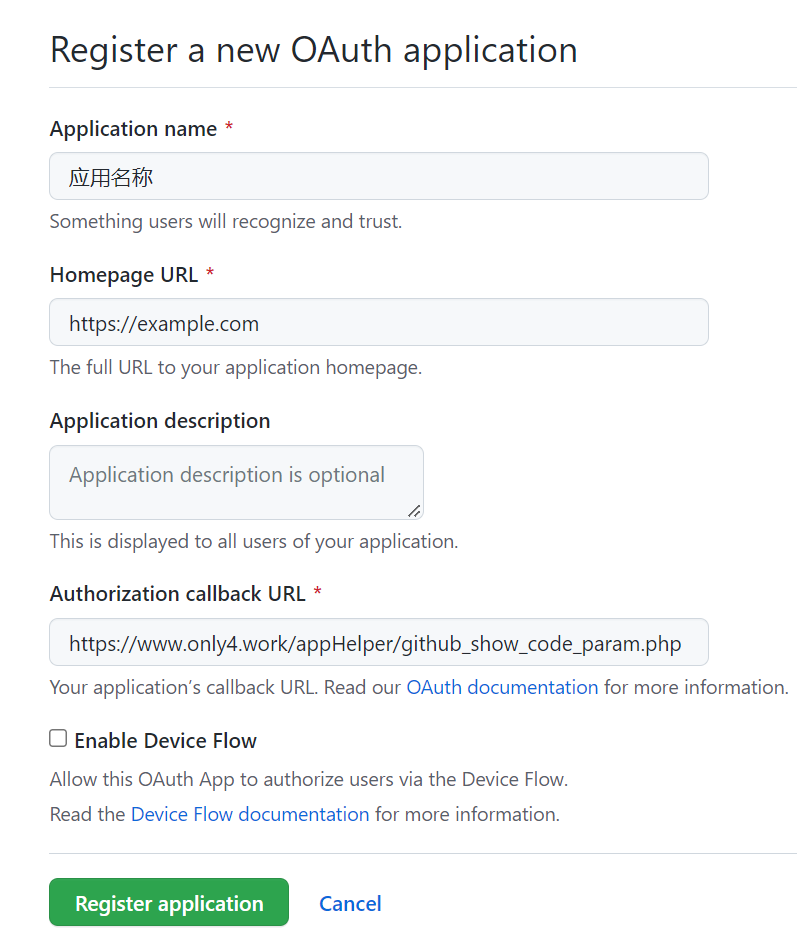
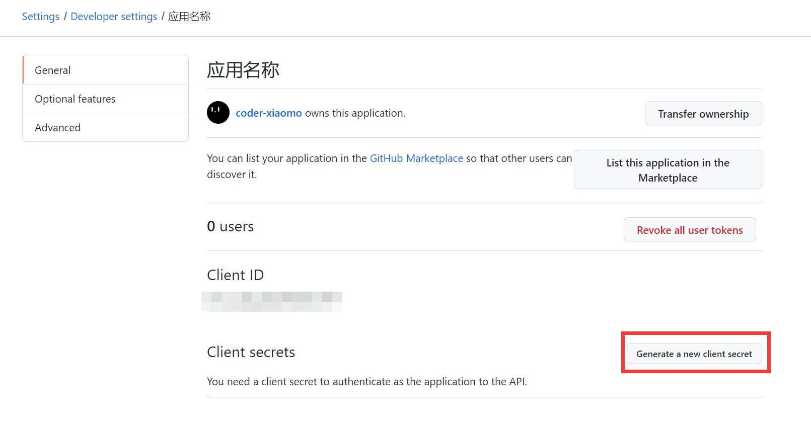
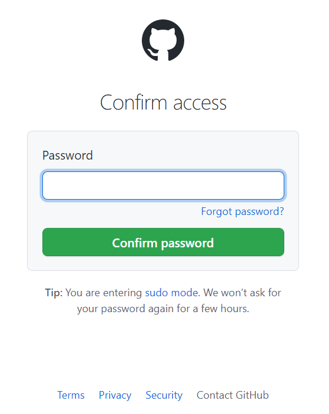
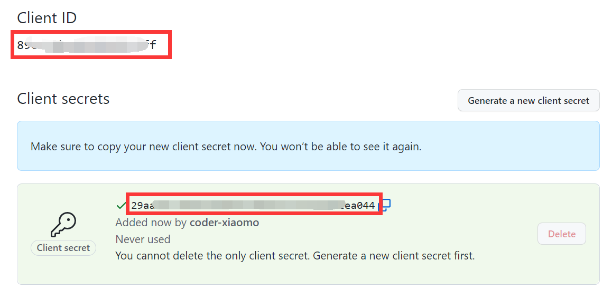

# Git仓库同步工具

*Gitee2gitHub*

本工具用于比较用户Gitee账号与GitHub账号中Git仓库，并进行同步（同名仓库镜像覆盖）。

> 注意：虽然本工具在开发过程中经过了很多的代码测试，但是由于测试环境较为复杂，没有办法做到覆盖每种情况，所以也许还会有Bug等等。本工具在Windows系统下开发，原理上来说Linux系统上或许也可以用，但是还未来得及测试。<span style="color: red;">建议有一定Git基础，能大致了解本工具原理的用户使用，如果您不了解本工具的同步原理，请一定不要盲目使用，因为一旦操作失误你可能会丢失仓库代码！</span>

## 目录

[toc]


## 使用准备

### 安装Git工具并配置

本地已安装Git工具，已配置Git全局设置。

```bash
# Git 全局设置 (Git安装后设置一次就行，如已设置请跳过)
git config --global user.name "提交显示的用户名"
git config --global user.email "youremail@example.com"
```

> 同时强烈建议配置下SSH，否则后面如果使用SSH方式克隆或推送仓库，每个私有仓库都需要在控制台舒勇账号密码。


### 安装Python及依赖库

脚本运行环境：Python 3.x（不支持Python 2.x） ，建议使用3.8以上版本的Python。


### 下载本仓库代码

**方式1**：克隆当前仓库并切换到master分支

> 特别注意！克隆后一定要删除本地仓库中的 .git 隐藏文件夹，否则后面将 Gitee 仓库克隆下来后再推送到 GitHub 会造成 Git 仓库嵌套，推送时当前脚本的仓库会覆盖目标 GitHub 仓库！
>
> <span style="color: red;">同时也特别注意不要在其他的 Git 仓库中进行操作，这样的话会把最外层的 Git 仓库推送到目标仓库！</span>

```bash
# 切换到你想使用的路径
# cd /path/to/where/you/like

# 克隆当前仓库
git clone https://gitee.com/coder-xiaomo/gitee2github

# 进入克隆好的仓库
cd ./gitee2github

# 切换到 master 分支下
git checkout master

# 重要！删除仓库中的 .git 文件夹(执行命令时记得去掉前面的 # 注释符)
# Linux系统下
# rm -rf ./.git
# Windows系统下
# rd /s /q .\.git
```


**方式2**：点击仓库页面的下载按钮下载代码压缩包




### 安装所需的库

> 项目使用了以下库👇
>
> - Python标准库（[官方文档](https://docs.python.org/zh-cn/3/library/index.html)）
>   - os - 执行系统命令
>   - signal - 捕获Ctrl+C退出信号
>   - webbrowser - 打开浏览器
>   - time - 时间模块
>   - shutil - 文件夹操作
>   - json - 读写JSON
>   - configparser - 读取ini配置文件
>   - copy - 字典深拷贝
> - 第三方库
>   - requests - 发送请求

可以使用 `pip install` 命令安装缺少的库，如果您不确定是否已经安装，可以执行一遍以下命令，已经安装过的库会自动跳过

```bash
# 在克隆的项目目录下执行
# -i 参数指定了一个国内的镜像源，国内使用镜像源下载较快
pip install -r .\requirements.txt -i https://pypi.tuna.tsinghua.edu.cn/simple/
# 如果提示 Requirement already satisfied 说明已经安装过了，可以进行下一步

# 其实目前只需要安装 requests 这一个依赖库，所以也可以这样安装
# pip install requests -i https://pypi.tuna.tsinghua.edu.cn/simple/
```


### 创建Gitee第三方应用和GitHub OAuth App

#### 创建Gitee第三方应用

访问网址：https://gitee.com/oauth/applications ，点击右上角的 `创建应用` 按钮



需要填写的信息如图所示



填写以下信息👇

| 项目             | 说明                                                         |
| ---------------- | ------------------------------------------------------------ |
| 应用名称         | 随便填                                                       |
| 应用主页         | 随便填写一个网站即可（需要带上 `http://` 或 `https://` 前缀） |
| **应用回调地址** | 原理上来说可以随便填，但是需要跟代码中写的回调地址保持一致。<br />所以建议大家这里填写为 `https://www.only4.work/appHelper/gitee_show_code_param.php` <br />（这就是一个简单的静态页，其作用就是等待授权成功后跳转到此页面，此页面展示出Gitee服务器传来的参数） |
| logo             | 随便传一张图上去即可                                         |
| **权限**         | 勾选 `projects` 权限                                         |

创建成功后会得到 `Client ID` 和 `Client Secret`，将这两个信息复制保存下来，在下一步配置config.ini文件的时候需要。


#### 创建 GitHub OAuth App

访问网址：https://github.com/settings/developers ，点击右上角的 `New OAuth App` 按钮

> 请注意是创建 `OAuth Apps` 而不是 `GitHub Apps`



需要填写的信息如图所示



填写以下信息👇

| 项目             | 说明                                                         |
| ---------------- | ------------------------------------------------------------ |
| Application name | 随便填                                                       |
| Homepage URL     | 随便填写一个网站即可（需要带上 `http://` 或 `https://` 前缀） |
| **应用回调地址** | 原理上来说可以随便填，但是需要跟代码中写的回调地址保持一致。<br />所以建议大家这里填写为 `https://www.only4.work/appHelper/github_show_code_param.php` <br />（这就是一个简单的静态页，其作用就是等待授权成功后跳转到此页面，此页面展示出Gitee服务器传来的参数） |

创建成功后会得到 `Client ID` ，点击 `Generate a new client secret` 生成一个  `Client Secret`。



此时可能需要输入GitHub密码



得到 `Client ID` 和 `Client Secret`，将这两个信息复制保存下来，在下一步配置config.ini文件的时候需要。

> 注意 GitHub 的 `Client Secret` 只会在生成后显示一次，之后如果忘记则选哟重新生成一个，不像 Gitee 随时可以查看。



将这两个信息复制保存下来，在下一步配置config.ini文件的时候需要。


### 配置config.ini和mapping.json

#### 配置 config.ini

> config.ini中主要配置Gitee和GitHub请求相关的信息。

将仓库中的 `config.sample.ini` 复制一份，并修改文件名为 `config.ini`。

配置文件模板

```ini
; Please use UTF-8 encoding format to save the file.

; Gitee 配置
[Gitee]
; 应用 ClientID 与 ClientSecret
ClientID=YOUR_CLIENT_ID
ClientSecret=YOUR_CLIENT_SECRET
; 使用 ssh 还是 https 进行仓库 pull /push  可选项：https / ssh （填写其他值默认使用 https）
Protocol=https
; 代理 例如：127.0.0.1:15732 不使用代理请留空
Proxy=

; GitHub 配置
[GitHub]
; 应用 ClientID 与 ClientSecret
ClientID=YOUR_CLIENT_ID
ClientSecret=YOUR_CLIENT_SECRET
; 使用 ssh 还是 https 进行仓库 pull /push  可选项：https / ssh （填写其他值默认使用 https）
Protocol=https
; 代理 例如：127.0.0.1:15732 不使用代理请留空
Proxy=

[Common]
; 请求超时时间，单位为秒，默认值为 10
RequestTimeout=10
```

请不要修改config.ini的结构，只需要修改值即可。

| 配置项                 | 说明                                                         |
| ---------------------- | ------------------------------------------------------------ |
| [Gitee]                |                                                              |
| ClientID、ClientSecret | 上面得到的 Gitee 的 `Client ID` 和 `Client Secret` 分别填入。 |
| Protocol               | 指定克隆git仓库时使用https地址还是ssh地址。<br />ssh需要先行现在本地配置好后才可以克隆<br />对于私有仓库，https克隆每个仓库都需要输入账号密码 |
| Proxy                  | 配置代理服务器。国内Gitee访问不需要使用代理，所以留空即可    |
| [GitHub]               |                                                              |
| ClientID、ClientSecret | 上面得到的 GitHub 的 `Client ID` 和 `Client Secret` 分别填入。 |
| Protocol               | 指定克隆git仓库时使用https地址还是ssh地址。<br />ssh需要先行现在本地配置好后才可以克隆<br />对于私有仓库，https克隆每个仓库都需要输入账号密码 |
| Proxy                  | 配置代理服务器。GitHub访问时很有可能出现访问缓慢，时不时无法访问的情况。如果您有VPN代理服务器，可以将代理服务器地址填写到此处。<br />如果您不知道代理服务器的意思，那么此处留空即可，只是后面进行到GitHub授权的位置会有一定概率失败，多重试几次即可。 |
| [Common]               |                                                              |
| RequestTimeout         | 请求超时时间，单位为秒，默认值为 10 秒                       |


#### 配置mapping.json（可选）


##### 配置


将仓库中的 `mapping.sample.json` 复制一份，并修改文件名为 `mapping.json`

````json
{
    "orgNameMap": {
        "from1": "to1",
        "from2": "to2"
    },
    "repoNameMap": {
        "from1": "to1",
        "from2": "to2"
    },
    "fullNameMap": {
        "from1": "to1",
        "from2": "to2"
    }
}
````

| 配置项      | 说明                       |
| ----------- | -------------------------- |
| orgNameMap  | "用户名" 的对应关系        |
| repoNameMap | "仓库名" 的映射关系        |
| fullNameMap | "用户名/仓库名" 的映射关系 |

> 请注意，
>
> 1. 在此处设置映射后将使用映射后的值进行比较，映射前的值将不再参与比较
>
> 2. 只配置需要映射的字段，例如您不需要 fullNameMap 映射关系，那么 JSON 中就不配置这个字段。如果这三个字段都不需要，那么请不要创建 mapping.json 文件（空mapping.json文件执行时会报错）


##### 说明

###### 什么是映射？

映射就是在您的Gitee和GitHub个人地址、或仓库地址地址不同，但是这两个仓库需要同步仓库时使用。

> 例如：您的 Gitee 用户地址为 `https://gitee.com/username1`，而 GitHub 用户地址为 `https://github.com/username2`，那么就可以配置 “orgNameMap”，使得 `username1` 映射为 `username2` 。
>
> （设置之后 Gitee下的 `username1` 将不再与 GitHub 下的 `username1` 匹配，而是与与 GitHub 下的 `username2` 匹配）


###### 映射有哪几种？

本项目分了三个维度的映射，分别是 orgNameMap，repoNameMap和fullNameMap。

orgNameMap是用户地址的映射，repoNameMap是全映射（综合前两种）

| 举例               | 配置fullNameMap                          | 配置orgNameMap           | 配置repoNameMap          |
| ------------------ | ---------------------------------------- | ------------------------ | ------------------------ |
|                    | "orgname/reponame": "org-name/repo-name" | "orgname": "org-name"    | "reponame": "repo-name"  |
| orgname/reponame   | 映射为org-name/repo-name                 | 映射为org-name/reponame  | 映射为orgname/repo-name  |
| org-name/reponame  | 不变                                     | 不变                     | 映射为org-name/repo-name |
| orgname/repo-name  | 不变                                     | 映射为org-name/repo-name | 不变                     |
| org-name/repo-name | 不变                                     | 不变                     | 不变                     |


###### 具体是怎么匹配的？匹配步骤是什么？

现在有gitee的一个仓库 org1/repo1 ，GitHub的一个仓库 org2/repo2

1. 检测 org1/repo1 是否在 fullNameMap 映射中，如果在，那么将其映射为 org1'/repo1'，再将 org1'/repo1' 与 org2/repo2 匹配；
2. 若不在 fullNameMap 映射中，那么进行 orgNameMap 和 repoNameMap 匹配。 org1/repo1 会先被映射为 org1''/repo1，紧接着被映射为 org1''/repo1''，再将 org1''/repo1'' 与 org2/repo2 匹配；
3. 若 org1/repo1 不在上述映射范围内，那么直接将 org1/repo1 与 org2/repo2 匹配。


## 项目详细介绍

### 原理

首先，使用配置好的 `Client ID` 和 `Client Secret` 对自己进行授权，授予当前进程对账号下的所有仓库的列表读取权限，分别获取 Gitee 和 GitHub 账号下的所有仓库。然后进行逐一映射匹配，得到一个同步映射关系。最后生成命令行脚本，完成Git裸仓库的克隆以及推送(核心: `git clone --mirror repo_url1` 和 `git push --mirror repo_url2` )。

项目代码中很多地方都标注有详细的注释，感兴趣的小伙伴儿可以研究研究，也欢迎和我交流。

> 注意：由于GitHub和Gitee限制，最多读取100个仓库信息。如需同步更多仓库，请修改 `assets/giteeOauth.py` 和 `assets/githubOauth.py` 脚本中的逻辑进行分批获取。也欢迎给本仓库提PR。


### 项目结构

```bash
gitee2github
 ├ .git                # [d] Git仓库文件(运行前需要删除)
 ├ assets              # [d]
 |  ├ __pycache__      # [d](运行时生成) 脚本运行时自动生成的文件夹，没有用，可以删除
 |  ├ *.py             # [-] 脚本运行所需脚本
 ├ image               # [d]
 |  ├ *.png            # [-] README.md 文件中引入的图片
 ├ WorkingDir          # [d](运行时生成)
 |  ├ *.git            # [d](运行时生成) 克隆到本地的Git裸仓库
 |  ├ commands.bat     # [-](运行时生成) 生成的bat命令
 |  ├ GlobalVars.json  # [-](运行时生成) 项目运行时记录，包含获取的仓库信息等
 ├ .gitignore          # [-] Git仓库文件
 ├ config.sample.ini   # [-] 配置文件模板
 ├ config.ini          # [-] 配置文件(必须设置)
 ├ LICENSE             # [-] 项目 MIT 许可证
 ├ main.py             # [-] 主程序
 ├ mapping.sample.json # [-] 仓库映射关系设置模板
 ├ mapping.json        # [-] 仓库映射关系设置(可选)
 ├ README.md           # [-] 自述文件
 ├ requirements.txt    # [-] 项目运行所需依赖库说明文件
```

\* `d` 代表文件夹，`-` 代表文件


